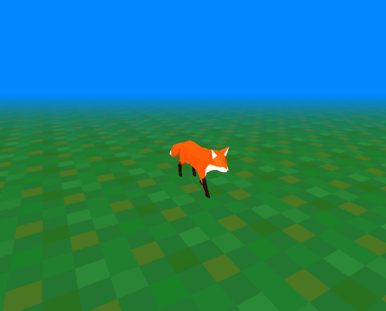

# Character Movement in Three.js



An example of basic character and camera movement in [Three.js](https://threejs.org/).

## How to Play

| Action          |    Buttons    |
| --------------- | :-----------: |
| **Walk**        |    Arrows     |
| **Run**         | Arrows + Ctrl |
| **Look Around** |     Space     |
| **Show Help**   |       I       |

## Setup

First, you need to download and install [Node.js](https://nodejs.org/en/download/). Then, clone or download the project, and while inside its main folder run the following commands:

```bash
# Install dependencies (only the first time)
npm install

# Run the local server at localhost:8080
npm run dev

# Build for production in the dist/ directory
npm run build
```

## Plans

- Implement running (listening to multiple keys pressed events)
- Add instructions modal
- Smoother animations
- Add more objects

## License

[MIT License](https://opensource.org/licenses/MIT)
